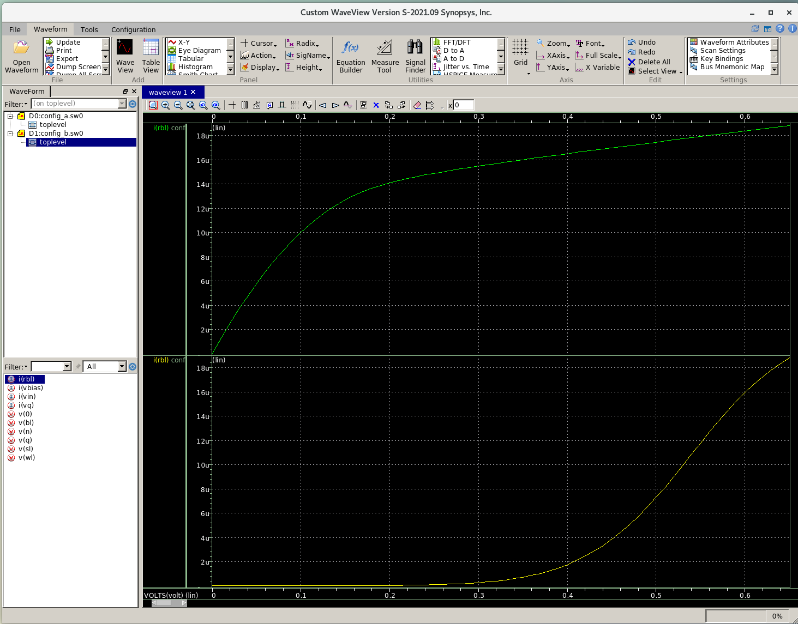

# PIM Final Project

Simulation of 8T-SRAM X-CIM as matrix-vector dot-product engines (DPEs).

## Dependency

- Python 3.12

- Synopsys HSPICE


## How to Run

```bash
make clean; make all
```

## Results

### Cell I-V Characteristics
We rebuild the two types of SRAM cells (Config-A and Config-B) as in `jaiswal20198t`.
We use the default 45-nm PTM technology and set $V_{DD} = 0.65V$ and sensing resistance $R_{f} = 50 \Omega$.
The simulated I-V curves match the results from the original paper. 
You can find the waveform in `example/*.sw0`.


### Worst-Case Analysis

We estimate the worst-case error rate of different DPEs, where all the SRAM cells store weight $1$ and all the input voltage is set to $V_{in, max}$. 
The experiment results is summarized in the tables below. You can also find the corresponding results in `report/table.csv`.

| Cell Type | Line Resistance?   | PVT variation?        | Array Size = 4 | Array Size = 8 | Array Size = 16 | Array Size = 32 |
|-----------|--------------------|-----------------------|----------------|----------------|-----------------|-----------------|
| A         | No                 | No                    | 1.74%          | 3.95%          | 8.05%           | 15.19%          |
| A         | Yes                | No                    | 1.97%          | 4.71%          | 10.57%          | 22.71%          |
| A         | Yes                | Yes                   | 1.97%          | 4.71%          | 10.57%          | 22.71%          |
| B         | No                 | No                    | 1.99%          | 4.51%          | 9.14%           | 17.07%          |
| B         | Yes                | No                    | 2.24%          | 5.30%          | 11.68%          | 24.32%          |
| B         | Yes                | Yes                   | 2.24%          | 5.30%          | 11.68%          | 24.32%          |

### Normal-Case Analysis

We estimate the normal-case error rate of different DPEs, where SRAM cells randomly store weight $0$ or $1$, and all the input voltage is uniformly sampled from $[V_{in, min}, V_{in, max}]$. 
We run Monte-Carlo simulation for 10 rounds and record the average error rate.
The experiment results is summarized in the tables below. You can also find the corresponding results in `report/table.csv`.

| Cell Type | Line Resistance?   | PVT variation?        | Array Size = 4 | Array Size = 8 | Array Size = 16 | Array Size = 32 |
|-----------|--------------------|-----------------------|----------------|----------------|-----------------|-----------------|
| A         | No                 | No                    | 64.57%         | 88.53%         | 41.06%          | 25.81%          |
| A         | Yes                | No                    | 118.96%        | 69.42%         | 50.89%          | 24.05%          |
| A         | Yes                | Yes                   | 174.53%        | 58.15%         | 45.87%          | 22.56%          |
| B         | No                 | No                    | 240.75%        | 162.78%        | 124.85%         | 87.15%          |
| B         | Yes                | No                    | 230.24%        | 155.03%        | 86.82%          | 71.84%          |
| B         | Yes                | Yes                   | 311.68%        | 143.00%        | 95.26%          | 88.58%          |


## Nonidealities

The nonidealities factors can be summarized as follows:

- **Nonlinear I-V characteristics**. This problem is very severe in the normal-case analysis.

- **Voltage drop on sensing resistance**. As the array size increases, the error rate increases as well due to this nonideality.

- **Parasitic voltage drop on line resistance**. We adopt the empirical value from the reference paper and find the error rate slightly increases. Notably, since the SL supply voltage comes from one side of the array, the SRAM cells at the other side suffers more from the parasitic voltage drop.

- **Transistor threshold variations**. We only consider local $V_T$ variations, as the global $V_T$ variation can be effectively mitigated by adjusting supply voltage accordingly. As shown from the results, such nonideality is largely cancelled off during the accumulation of partial products.

## References

```
@article{jaiswal20198t,
  title={8T SRAM cell as a multibit dot-product engine for beyond von Neumann computing},
  author={Jaiswal, Akhilesh and Chakraborty, Indranil and Agrawal, Amogh and Roy, Kaushik},
  journal={IEEE Transactions on Very Large Scale Integration (VLSI) Systems},
  volume={27},
  number={11},
  pages={2556--2567},
  year={2019},
  publisher={IEEE}
}
```